<div align="center">

# IsoDAQ Studio

**A serial terminal and real-time data-acquisition frontend for embedded systems development.**

Built with **Python 3 · PyQt6 · pyqtgraph** — runs on **Windows · Linux · macOS**.

[](https://github.com/AlexShateljuk/isodaq/actions/workflows/ci.yml)
[](LICENSE)
[](https://github.com/AlexShateljuk/isodaq/wiki)

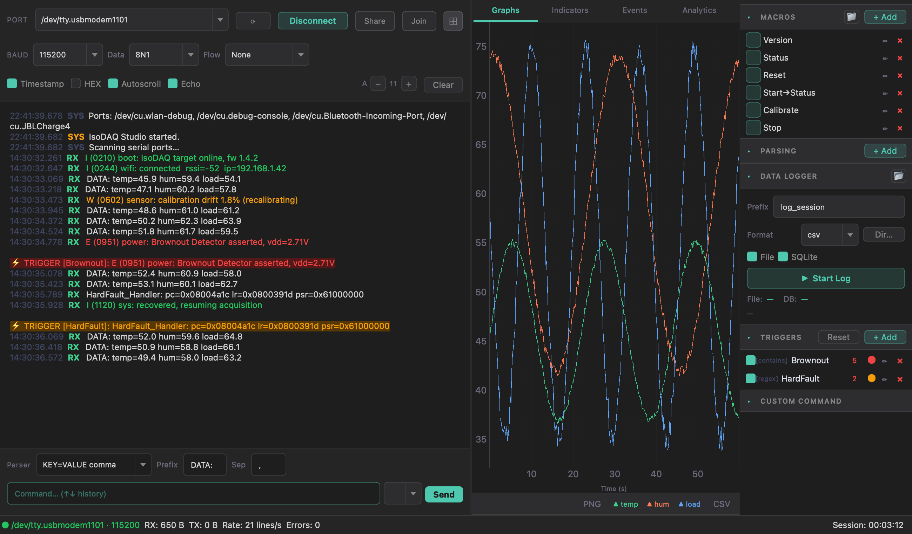

</div>

> Connect to a serial device, watch the traffic scroll by with millisecond
> timestamps and log-level colouring, pull named numeric channels out of the
> stream, plot them live, fire alerts on the lines that matter, log everything to
> CSV + SQLite, and share the whole session with a colleague anywhere in the
> world — all from one window.

---

## 📖 Documentation

This README is the **overview with pictures**. For a **detailed, page-per-feature
guide**, see the **[Wiki](https://github.com/AlexShateljuk/isodaq/wiki)**:

| Getting started | Working with data | Automation & sharing |
|-----------------|-------------------|----------------------|
| [Getting Started](https://github.com/AlexShateljuk/isodaq/wiki/Getting-Started) | [Data Parser](https://github.com/AlexShateljuk/isodaq/wiki/Data-Parser) | [Triggers](https://github.com/AlexShateljuk/isodaq/wiki/Triggers) |
| [Interface Overview](https://github.com/AlexShateljuk/isodaq/wiki/Interface-Overview) | [Live Views](https://github.com/AlexShateljuk/isodaq/wiki/Live-Views) | [Macros](https://github.com/AlexShateljuk/isodaq/wiki/Macros) |
| [Serial Connection](https://github.com/AlexShateljuk/isodaq/wiki/Serial-Connection) | [Data Logger](https://github.com/AlexShateljuk/isodaq/wiki/Data-Logger) | [Session Sharing](https://github.com/AlexShateljuk/isodaq/wiki/Session-Sharing) |
| [Terminal](https://github.com/AlexShateljuk/isodaq/wiki/Terminal) | [Log Colorizer](https://github.com/AlexShateljuk/isodaq/wiki/Log-Colorizer) | [Themes, Modes & Settings](https://github.com/AlexShateljuk/isodaq/wiki/Themes-Modes-and-Settings) |

---

## Contents

- [Quick start](#quick-start)
- [Pre-built binaries](#pre-built-binaries)
- [The interface at a glance](#the-interface-at-a-glance)
- [Features](#features)
- [Architecture](#architecture)
- [Project structure](#project-structure)
- [Performance](#performance)
- [Contributing](#contributing) · [Security](#security) · [License](#license)

---

## Quick start

### Running from source

```bash
git clone https://github.com/AlexShateljuk/isodaq.git
cd isodaq
pip install -r requirements.txt
python main.py
```

Requirements: Python 3.10+, see `requirements.txt` for package versions.

### Pre-built binaries

Download the latest release for your platform from the
[Releases](https://github.com/AlexShateljuk/isodaq/releases) page.

| Platform | File | How to run |
|----------|------|-----------|
| Windows 10/11 x64 | `IsoDAQ-Studio-windows-x64.zip` | Extract → run `IsoDAQ Studio.exe` |
| Linux x64 | `IsoDAQ-Studio-linux-x64.tar.gz` | Extract → `chmod +x "IsoDAQ Studio"` → run `./IsoDAQ\ Studio` |
| macOS Apple Silicon (M1+) | `IsoDAQ-Studio-macos-arm64.zip` | Extract → drag `IsoDAQ Studio.app` to Applications |
| macOS Intel | *(no pre-built binary)* | Run from source — see [Running from source](#running-from-source) |

> **Intel Macs:** GitHub's Intel CI runners are being retired and can queue for
> hours, so releases ship an Apple-Silicon (arm64) build only. IsoDAQ Studio is
> a pure-Python app, so on an Intel Mac just run it from source
> (`pip install -r requirements.txt && python main.py`).

> **Unsigned builds:** releases are not code-signed/notarized (no paid
> certificates), so the OS shows a first-run warning. This is expected.
> - **macOS** — Gatekeeper says *"unidentified developer"*: **right-click the
>   app → Open → Open**, once. (If you see *"damaged"*, remove the quarantine
>   flag: `xattr -dr com.apple.quarantine "IsoDAQ Studio.app"`.)
> - **Windows** — SmartScreen shows *"Windows protected your PC"*: click
>   **More info → Run anyway**.

> **Linux note:** if the app does not start, install the Qt platform plugin dependencies:
> ```bash
> sudo apt-get install libxcb-cursor0 libxcb-xinerama0 libegl1
> ```

More detail: **[Getting Started](https://github.com/AlexShateljuk/isodaq/wiki/Getting-Started)** ·
**[Building from source](https://github.com/AlexShateljuk/isodaq/wiki/Building-From-Source)**.

---

## The interface at a glance

A single window, split into a **terminal side** (left) and a **data side** (right).

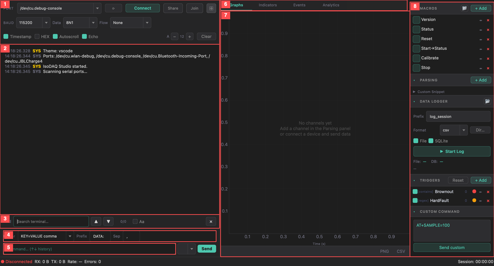

| # | Region | What it does |
|---|--------|--------------|
| 1 | **Port bar** | Port / baud / framing, Connect, Share & Join, panel toggle |
| 2 | **Terminal** | Timestamped, colour-coded RX/TX with optional log-level highlighting |
| 3 | **Find bar** | In-terminal search (`Ctrl+F`) |
| 4 | **Parser strip** | Default parser type / prefix / separator for new channels |
| 5 | **Command input** | Send line + EOL selector, `↑ ↓` command history |
| 6 | **Tabs** | Graphs · Indicators · Events · Analytics (each pops out with `⤢`) |
| 7 | **Chart area** | Live plots / value cards / event log for the active tab |
| 8 | **Sidebar** | Macros · Parsing · Data Logger · Triggers · Custom command |

Two layout modes (**Advanced** / **Simple**), two themes (**Dark** / **Light**),
both persisted across sessions.
→ **[Interface Overview](https://github.com/AlexShateljuk/isodaq/wiki/Interface-Overview)**

---

## Features

### Serial connection

- Port, baud rate (9 600 – 921 600), data bits, parity, stop bits, flow control (None / RTS/CTS / XON/XOFF)
- High-throughput reader: `in_waiting` chunk reads — no per-line latency at high baud rates
- Partial-line flush: incomplete lines without a trailing `\n` are emitted after 250 ms of silence
- Automatic disconnect detection with UI reset
- RX / TX byte counters and session timer in the status bar
- Configurable EOL terminator (`\r\n` / `\n` / `\r` / none)
- Command history navigation (↑ ↓)

→ **[Serial Connection guide](https://github.com/AlexShateljuk/isodaq/wiki/Serial-Connection)**

### Terminal

- Monospace output with millisecond timestamps
- HEX display mode
- Autoscroll toggle with manual override
- Echo TX back to terminal
- Adjustable font size (8 – 24 pt), persisted across sessions
- Configurable scrollback limit (default 5 000 lines)
- Colour-coded lines: RX · TX · SYS · ERR

→ **[Terminal guide](https://github.com/AlexShateljuk/isodaq/wiki/Terminal)**

### Log Colorizer

Highlights RX lines by log level based on the active platform profile.

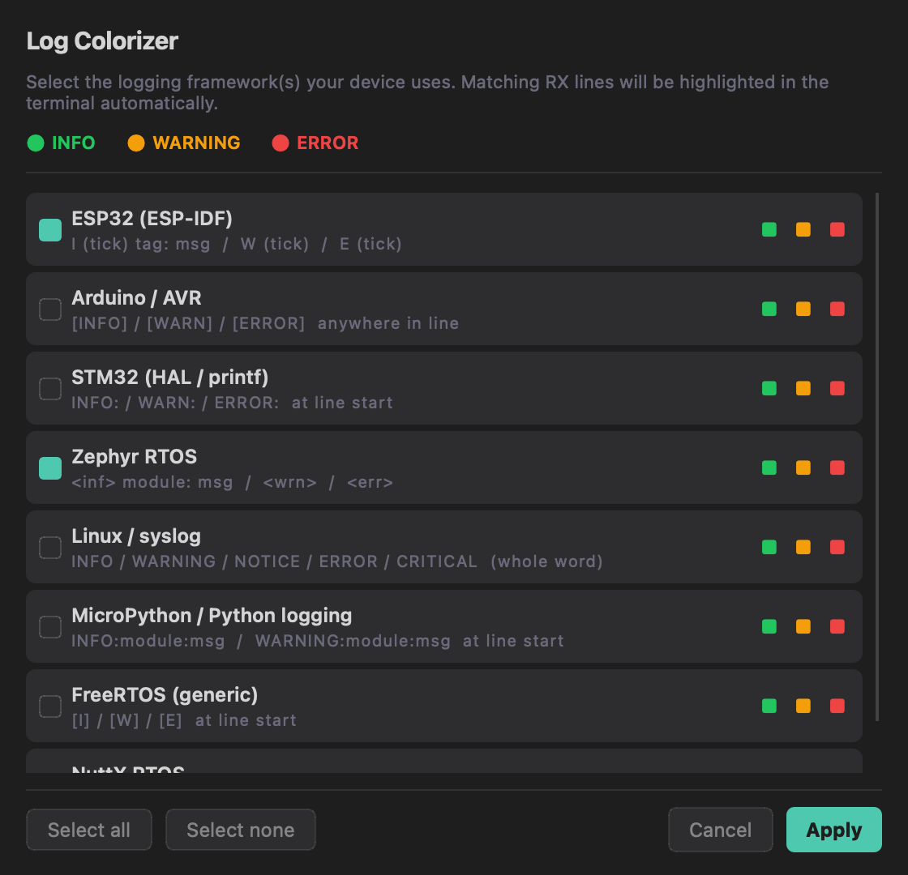

| Colour | Level |
|--------|-------|
| Green  | INFO |
| Yellow | WARNING / NOTICE |
| Red    | ERROR / CRITICAL |

Supported platforms: ESP32 (ESP-IDF), Arduino / AVR, STM32 (HAL / printf), Zephyr RTOS,
Linux / syslog, MicroPython / Python logging, FreeRTOS (generic), NuttX RTOS.
Multiple platforms can be active simultaneously (`Settings → Log Colorizer…`).

→ **[Log Colorizer guide](https://github.com/AlexShateljuk/isodaq/wiki/Log-Colorizer)**

### Data parser

Extracts named numeric channels from RX lines in real time.

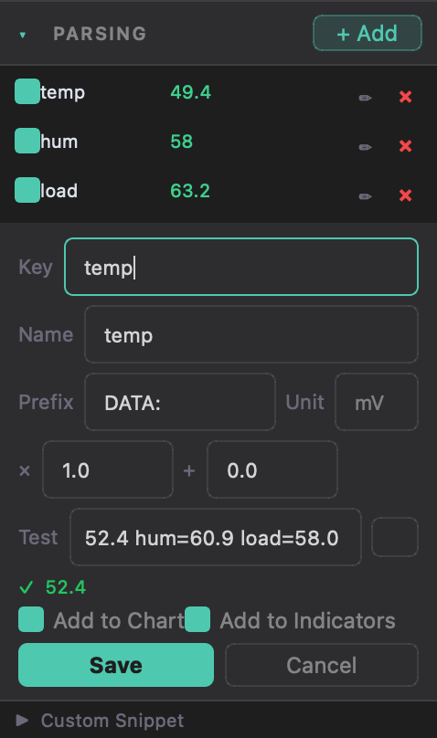

| Field | Purpose |
|-------|---------|
| Key | Token to search for (`snap.pv_v`, `vbat`, `data.voltage`) |
| Prefix | Line filter — only lines containing this string are parsed |
| Unit | Disambiguates multiple tokens (`pv=43608mV 847mA` → Unit `mV` → `43608`) |
| × / + | Scale and offset applied after extraction |

Parser modes: **KEY=VALUE**, **JSON**, **CSV ordered**, and **Regex / custom Python
snippet**. A built-in **Test** field verifies extraction against a sample line
before you commit a channel.

Parsed values feed the **Graphs**, **Indicators**, and **Trigger Events** views.

→ **[Data Parser guide](https://github.com/AlexShateljuk/isodaq/wiki/Data-Parser)**

<br clear="right">

### Live views

Every tab pops out into its own resizable window with the `⤢` button.

| Graphs | Indicators |
|--------|------------|
| 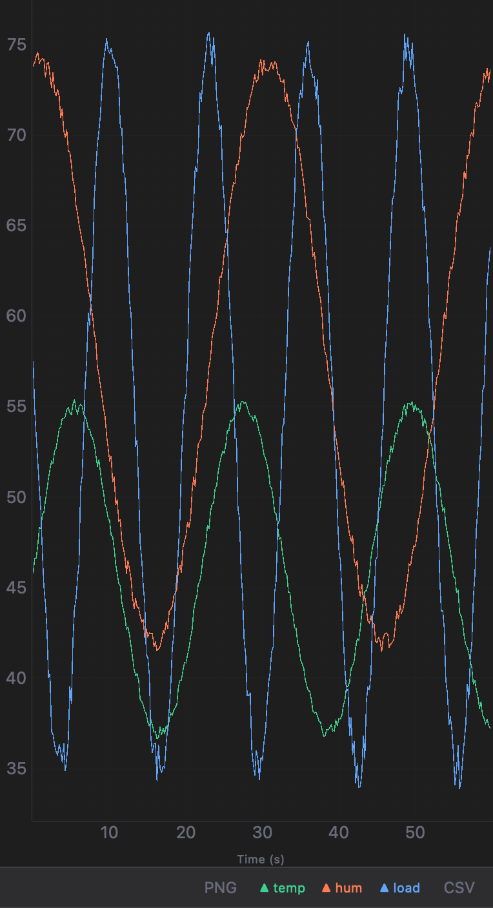 | 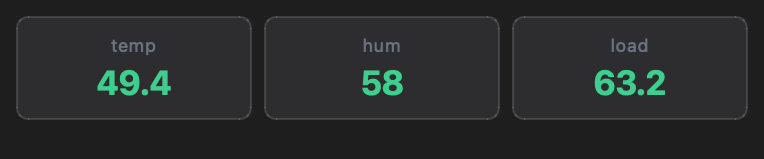 |
| Real-time scrolling chart (pyqtgraph): up to 8 channels, 60-second rolling window, 20 000-point ring buffer per channel, mouse pan/zoom, PNG/CSV export. | Live value grid — one large monospace card per channel, with per-card colour thresholds (double-click a card to edit). |

| Trigger Events | Analytics |
|----------------|-----------|
| 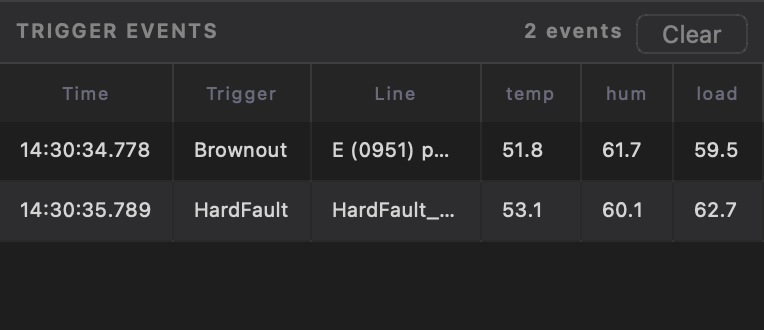 | 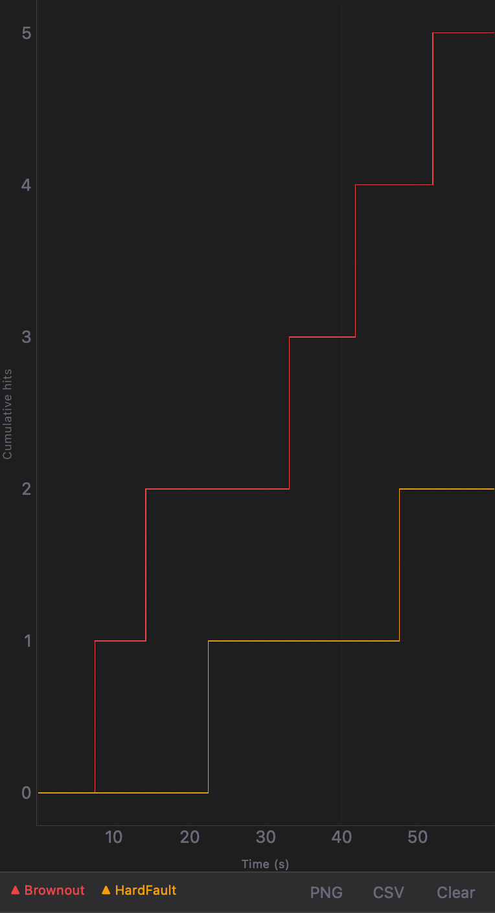 |
| Session log of every trigger match: **Time · Trigger · Raw line** + one column per active parsed channel. Double-click a row to jump back to that line in the terminal. | Cumulative per-trigger hit count as a staircase over time — bursts and quiet periods stand out at a glance. PNG/CSV export. |

→ **[Live Views guide](https://github.com/AlexShateljuk/isodaq/wiki/Live-Views)**

### Triggers

Alert rules evaluated against every incoming RX line in real time.

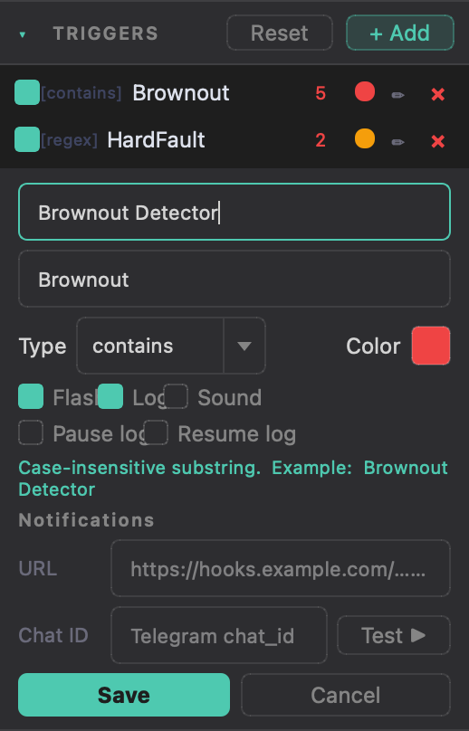

| Syntax | Example |
|--------|---------|
| Plain text (case-insensitive) | `Brownout Detector` |
| Regex | `[regex] hard.?fault\|HardFault_Handler\|ERR_\d+` |
| Python lambda | `[python] lambda line: 'ERR' in line and '=' in line` |

Actions per trigger: **Flash** (coloured banner) · **Log** (marker in log file) ·
**Sound** (system beep) · **Pause log** · **Resume log**, plus optional
**webhook / Telegram notifications**.

Hit counters per trigger update live and reset on session clear.
Triggers are saved and loaded as JSON (`File → Save triggers… / Load triggers…`).

> ⚠️ `[python]` triggers execute arbitrary code by design. Files loaded from an
> untrusted source keep their Python rules **blocked** until you review and enable them.

→ **[Triggers guide](https://github.com/AlexShateljuk/isodaq/wiki/Triggers)**

<br clear="right">

### Macros

Configurable command sequences sent over serial.

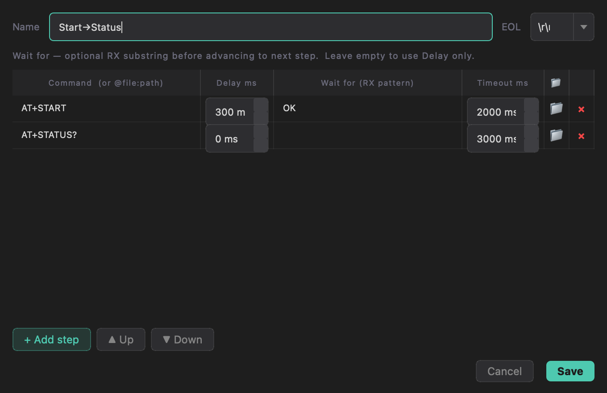

- Each step has a **command**, an optional **inter-step delay**, and an optional
  **wait-for RX pattern** with timeout (handshake-style sequencing)
- A step can send a file directly (`@file:path`) over serial
- "Run" executes the sequence; "Stop" aborts mid-run; live step progress (`2/3`)
- Macros are saved/loaded as part of the session settings

→ **[Macros guide](https://github.com/AlexShateljuk/isodaq/wiki/Macros)**

### Data logger

- Start / Stop session with one click
- **Dual sink**: CSV file + SQLite database written in parallel via a lock-free queue
- Formats: CSV (`timestamp, trigger, raw`) · JSON lines · raw text
- SQLite: WAL mode + batched `executemany` — no write contention at high data rates
- Configurable filename prefix and output directory
- Live stats: file size and row count, updated every 500 ms
- "Open folder" shortcut opens the log directory in the OS file manager

→ **[Data Logger guide](https://github.com/AlexShateljuk/isodaq/wiki/Data-Logger)**

### Session sharing (Share & Join)

Share live serial output with a colleague anywhere in the world — both sides just run
IsoDAQ Studio. No browser, no account, no extra dependencies (pure stdlib on both ends).
One host can stream to **multiple viewers** at once.

There are two ways to join, for two situations:

**1. By address — same network (LAN / VPN).** Direct TCP, lossless, lowest latency.

```
Host  ──────────  direct TCP :9876  ──────────  Viewer
   (192.168.x.x — shown in the Share dialog)
```

**2. By code — over the internet (through any NAT/firewall).** A small hosted
signaling+relay server brokers the connection; no router setup needed.

```
Host                     Signaling + Relay Server                Viewer(s)
  │── register (STUN IP) ───────>│                                  │
  │      → 6-digit code          │<──── look up code ───────────────│
  │── push serial lines ────────>│──── long-poll / deliver ────────>│
  │                              │   (relay forwards the stream)    │
```

1. **Share** — click Share. The app starts the local TCP server, discovers your public
   IP via STUN, registers a **6-digit code**, and enables the relay. The dialog shows the
   code, the LAN address, and a live **Viewers: N** count.
2. **Join** — your colleague clicks Join → **By code** → types the code. Data flows over
   the relay, so it works even behind strict NAT/corporate firewalls.

When you click **Stop**, all viewers are notified and leave automatically.

> **LAN vs relay trade-off:** the LAN/direct-TCP path is lossless and low-latency. The
> relay path is **best-effort** — under sustained very high throughput, or on a network
> hiccup, individual lines may be dropped from the relayed stream. The host's own
> terminal and data logger always capture the complete record regardless.

**Connection quality** is shown in the status bar as a coloured LED + latency:

| Colour | Latency |
|--------|---------|
| 🟢 Green | ≤ 80 ms |
| 🟡 Yellow | 81 – 250 ms |
| 🔴 Red | > 250 ms or timeout |

A public relay is already configured by default, so sharing works out of the box.
You can also **[host your own relay](https://github.com/AlexShateljuk/isodaq/wiki/Session-Sharing#hosting-your-own-relay)**
(pure-stdlib server in `relay/`, deployable to Railway in minutes).

→ **[Session Sharing guide](https://github.com/AlexShateljuk/isodaq/wiki/Session-Sharing)**

### Themes, modes & other niceties

<div align="center">

| Dark (VS Code) | Light |
|:---:|:---:|
|  | 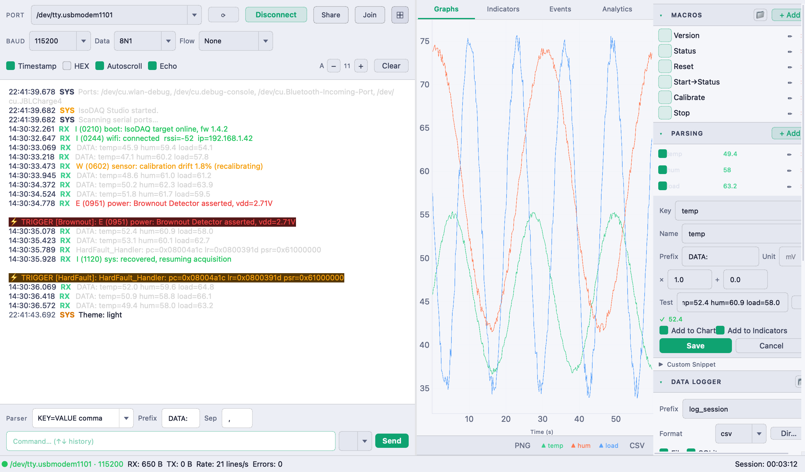 |

</div>

- **Themes** — Dark (`#1e1e1e` base, teal accents) and Light, switchable at runtime (`View → Theme`)
- **UI modes** — Advanced (full layout) and Simple (terminal-only), toggle with `Ctrl+Shift+M`
- **Auto-update check** — silent GitHub-Releases check on startup; a dismissible banner + OS notification appear if a newer version is out (`Help → Check for Updates` for a manual check)
- **Settings persistence** — all session state is saved on exit and restored next launch (`~/.isodaq_studio/config.json`)

→ **[Themes, Modes & Settings guide](https://github.com/AlexShateljuk/isodaq/wiki/Themes-Modes-and-Settings)**

---

## Architecture

```
SerialReader (QThread)
    │  line_received(line, ts)  ── Qt queued signal → GUI thread
    │
    ├──▶  TriggerEngine.check(line, ts)           thread-safe RLock
    │         └──▶  callbacks → MainWindow._on_trigger_match_gui()
    │
    ├──▶  Logger.write_line(line, ts)             lock-free queue.Queue
    │         └──▶  _LogWriter (daemon thread)
    │                   ├── _FileWriter   → .csv / .json / .txt
    │                   └── _SQLiteWriter → .db WAL
    │
    └──▶  MainWindow._on_line_received()          GUI thread
              ├── DataParser.parse(line)
              ├── ChartPanel / IndicatorPanel update
              ├── SessionServer.feed_line()        → broadcast to viewers
              └── terminal append + log colorizer

SessionClient (QThread)  ← viewer side
    └── line_received → MainWindow._on_remote_line()
```

See [docs/ARCHITECTURE.md](docs/ARCHITECTURE.md) for the full module map,
threading model, and a "where do I add…?" guide for contributors.

---

## Project structure

```
isodaq/
├── main.py                           # Entry point, version constant
├── requirements.txt
├── relay/                            # Signaling + relay server (deploy once to Railway)
│   ├── server.py                     # HTTP signaling + relay (fan-out, pure stdlib)
│   ├── Procfile                      # Railway/Heroku entry point
│   ├── nixpacks.toml                 # Pin Python build (don't auto-run main.py)
│   ├── railway.toml                  # Railway build/health config
│   ├── requirements.txt              # empty — stdlib only
│   └── README.md                     # Deploy instructions
├── core/
│   ├── serial_reader.py              # QThread serial reader
│   ├── logger.py                     # Async dual-sink logger
│   ├── triggers.py                   # Trigger engine
│   ├── macros.py                     # Macro runner
│   ├── data_parser.py                # Channel extraction engine
│   ├── i18n.py                       # Lightweight JSON-catalog translations
│   ├── updater.py                    # GitHub Releases update checker
│   ├── session_server.py             # TCP session server (Share side)
│   ├── session_client.py             # TCP session client (Join side)
│   ├── signaling.py                  # Signaling server register/lookup client
│   ├── stun_helper.py                # STUN public IP discovery (stdlib only)
│   └── notifier.py                   # Telegram / webhook trigger notifier
├── ui/
│   ├── main_window.py                # Main window, layout, signal wiring
│   ├── controllers/                  # Extracted controllers (serial, session, triggers, …)
│   ├── chart_panel.py                # pyqtgraph scrolling chart
│   ├── indicator_panel.py            # Live value indicator grid
│   ├── trigger_events_panel.py       # Trigger match event table
│   ├── parse_panel.py                # Parser channel editor
│   ├── trigger_panel.py              # Trigger editor
│   ├── macro_panel.py                # Macro editor
│   ├── logger_panel.py               # Logger controls
│   ├── log_colorizer_dialog.py       # Log colorizer settings
│   ├── analytics_panel.py            # Trigger hit analytics
│   └── themes.py                     # Dark / Light stylesheets
├── tools/
│   └── gen_screenshots.py            # Regenerates the docs/ screenshots
├── translations/                     # i18n catalogs (uk.json, …)
└── docs/
    ├── ARCHITECTURE.md
    └── images/                       # README + wiki screenshots
```

---

## Performance

At 921 600 baud continuous ASCII stream (~90 KB/s):

| Component | Strategy | Result |
|-----------|----------|--------|
| Serial read | `in_waiting` chunk reads | ~100 µs / iteration |
| Logger queue | Lock-free enqueue from serial thread | reader never waits for disk |
| File sink | Batch 256 lines → `writelines()` + `flush()` | every 200 ms |
| SQLite sink | `executemany`, WAL, `synchronous=NORMAL` | 512 rows / 500 ms |
| GUI | Queued Qt signal, scrollback capped | 5 000 lines default |

---

## Requirements

```
PyQt6 >= 6.6.0
pyserial >= 3.5
pyqtgraph >= 0.13
numpy >= 1.26
pyqt6-sip
```

---

## Contributing

Contributions are welcome — see [CONTRIBUTING.md](CONTRIBUTING.md) for setup and
the checks CI runs (`ruff check .` + `pytest`). Please also read the
[Code of Conduct](CODE_OF_CONDUCT.md). Changes are tracked in
[CHANGELOG.md](CHANGELOG.md).

> **Regenerating screenshots:** the images under `docs/images/` are produced by
> `python tools/gen_screenshots.py` (builds the real window, feeds synthetic data,
> saves `widget.grab()` PNGs). Re-run it after UI changes to keep the docs current.

## Security

Found a vulnerability? Please report it privately — see [SECURITY.md](SECURITY.md).
Note that `[python]` triggers and custom parser snippets execute arbitrary Python
by design; never enable Python rules from a config file you don't trust.

## License

IsoDAQ Studio is licensed under the **Apache License 2.0** — see [LICENSE](LICENSE)
and [NOTICE](NOTICE). You are free to use, modify, and distribute it, including for
commercial purposes, provided you retain the copyright/attribution notices.

Copyright 2026 eSOMtech.
